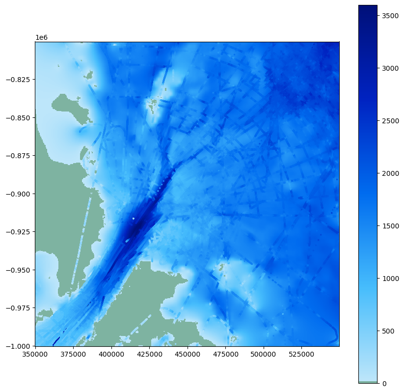

# Ice thickness

Directly model ice thickness from Bedmap3 data points. Byrd glacier.

# ToDo:
- domain-informed noise level
- std to count ratio: standard error

## Why do we model ice thickness and not the bed elevation?
- Hypothesis: Ice thickness distribution is smoother in space (than bed elevation) and thus easier to model with the choosen methods (GPs/kriging/kernel methods are naturally better at modelling smooth distributions.)
- Test this hypothesis with
    - Look at std
    - Fit simple GP model and interpret

## Why do we go directly from measurements to high-resolution bed topography models
- Because uncertainty quantification is much better this way.

## Research plans
- Investigate per grid error and number of data points
- Visualise number of data points
- Investigate roughness: Roughness ML module for post-processing needed? 
- Integrate MC ideas in kernel: physical consistency

## Considerations
- Check that geoid/ellipsoid reference is consistent. BedMachine uses ellipsoid.
- Check that height is consitent too. BedMachine fird-corrects to attain ice-equivalent values.
- Remove flight line that is dubious. ()

# Data

- Bedmap123 data preprocess and subsetted for this region around Byrd glacier.
    - **surface_altitude**: Surface elevation or altitude (referenced to WGS84) in meters
    - **land_ice_thickness**: Ice thickness in meters
    - **bedrock_altitude** Bed elevation or altitude (referenced to WGS84) in meters
- Bedmachine v3
    - In BedMachine Antarctica, all heights are referenced to mean sea level (using the geoid EIGEN-6C4). To
convert the heights to heights referenced to the WGS84 ellipsoid, simply add the geoid height
    - Ice equivalent units.

Corrections of BedMachine:
- Bed, thickness, and surface elevation need to be corrected to ellipsoid. 
- Ice thickness also needs to be firn corrected.

# About the data

The median gridding error over Byrd glacier for a 500 x 500 m grid is 9.5 meters.  
The mean gridding error over Byrd glacier for a 500 x 500 m grid is 16.3 meters.  
The mean SEM (standard error of the mean) over Byrd glacier for a 500 x 500 m grid is 3.9 meters.

# Scaleable inference

https://docs.gpytorch.ai/en/stable/examples/02_Scalable_Exact_GPs/index.html 

# Gradient observation

https://docs.gpytorch.ai/en/v1.11/examples/08_Advanced_Usage/Simple_GP_Regression_Derivative_Information_1d.html

# Morlighem MC

- Do we need to extend the region for the ice inflow (contraint on obs.) to be good.
- product: H * v (ice flux)
    - The resulting Ice Flux is often in cubic meters per year (m³/yr), representing the volume of ice transported by glaciers or ice sheets
    - gradient of ice flux
- radar-derived thickness data from multiple sources, with a vertical precision of ~30 m.

# Simulated experiments:

- **run_dfNN_experiments.py**
    - Loss: simple RMSE
    - matrix-field representation (U of A)
    - GPU enabled
    - N_runs = 10 to assess how much variability we have from initialisation randomness
    - seed enabled reproducibility
    - early stopping after 50 iterations of no improvement
    - test is 0 to 1
    - Metrics: RMSE, MAE, abs. divergence
    - Issues:
        - smoothness? batch size?
        - test loss is way too high for some reason...
        - TODO: calculate divergence loss over full domain?!
    - Outputs: 
        - **convergence_dfNN_metrics_summary.csv** mean metrics and std metrics over N_runs
        - **convergence_dfNN_metrics_per_run.csv** metrics for individual runs, make sure max_runs is high enough
        - **convergence_dfNN_losses_over_epochs.csv** is the loss convergence on train and test from the first run so check that 
        - **convergence_dfNN_test_predictions.pt** predictions from first run
- **run_PINN_experiments.py**
    - Loss: (1 - w) * RMSE + (w) * squared divergence with w = 0.5 or 0.3 for now
        - high variability with 0.3
    - Merge needs quite a few iterations
    - patience higher > 40 
    - Plot both loss components!
    - torch.load weights only is problematic
- **GP**
    - randomness in sampling initial HPs?
    - train on batches or not?
    - NLML convergence is much smoother
    - larger learning rate
    - plot how the hypers are learned over time
    - like dfNN_model.state_dict(), save best hypers
    - Comp. divergence
    - add metrics on train