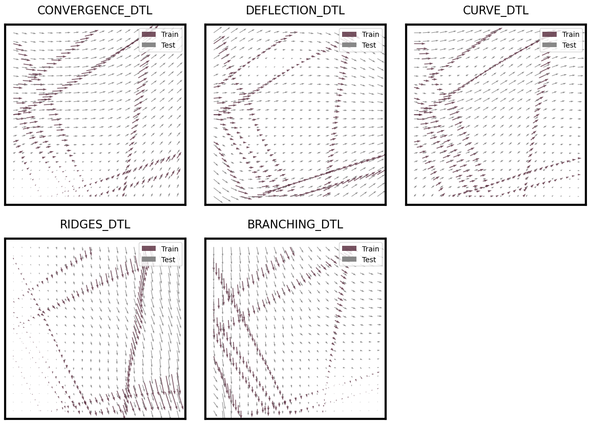
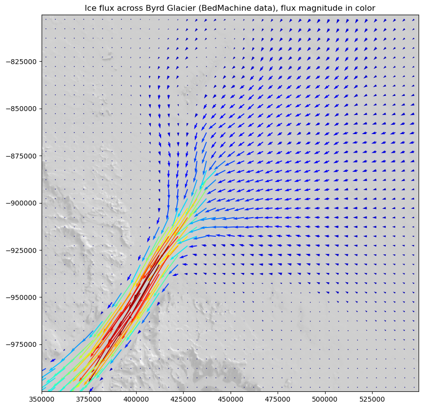
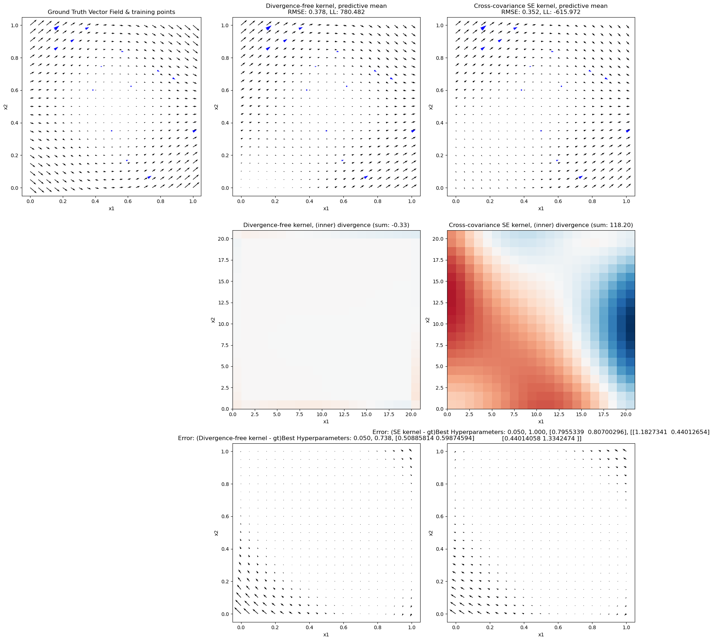

# Mass conservating ice flux vector fields with divergence-free Neural Gaussian Processes (dfNGPs)

In this repository we introduce a new methods, combining the strengths of [Neural Conservations Laws by Richter-Powell et al. 2022](https://arxiv.org/abs/2210.01741) and the in 2D equivalent class of [Hamiltonian Neural Networks introduced by Greydanus et al. in 2019](https://proceedings.neurips.cc/paper_files/paper/2019/file/26cd8ecadce0d4efd6cc8a8725cbd1f8-Paper.pdf) with probabilistic [Linearly constrained Gaussian Processes by Jidling et al. 2017](Jidling) to model divergence-free 2D vector fields. We use the divergence-free Neural Network as a highly expressive mean function within a divergence-free Gaussian Processes framework. This harnesses the property that the sum of two divergence-free vector fields remains divergence-free. We term our model a **divergence-free Neural Gaussian Processes (dfNGPs)**. Our model can quantify uncertainty and is guaranteed to produce divergence-free outputs (mean function as well as posterior samples). This it is suitable in applications where **data is sparse** and **uncertainty quantification** is critical. 

## Motivation for environmental applications

There are many applications in which a hard-constraint on divergence-free outputs helps to learn physically realistic phenomena, particulary when modelling incompressible fluids, where mass is conserved. 

## Experiments

We compare dfNGPs again hard-constrained dfNN, and dfGPs, as well as against soft-constrained PINNs and regular GPs. We perform experiments on 5 simulated examples as well as on ice flux data taked from InSAR ice velocity data as well as BedMachine/Bedmap3 ice thickness data from the Byrd glacier catchment in Antarctica. 

### Simulated data: divergence-free vector fields with sparse data

Run ```python run_dfGPdfNN_experiments.py``` to generate experimental results for n = 10 runs on all 5 experiments. All results will be saved in the results folder. Files ending with *_metric_summary.csv* such as *results/dfGPdfNN/branching_dtl_dfGPdfNN_metrics_summary.csv* contain the most important metrics. 

The train and test data for the simulated experiments look as such:



Training data is provided simular to data from flight lines from airborne geophysical surveys. 

### Real-data: Ice flux data Byrd

The following shows the ice flux over Byrd glacier, Antarctica overlaid on MODIS data.



# Simulated experiments notes (internal use)

- **run_dfNN_experiments.py**
    - Loss: simple RMSE
    - matrix-field representation (U of A)
    - GPU enabled
    - N_runs = 10 to assess how much variability we have from initialisation randomness
    - seed enabled reproducibility
    - early stopping after 50 iterations of no improvement
    - test is 0 to 1
    - Metrics: RMSE, MAE, abs. divergence
    - Issues:
        - smoothness? batch size?
    - Outputs: 
        - **convergence_dfNN_metrics_summary.csv** mean metrics and std metrics over N_runs
        - **convergence_dfNN_metrics_per_run.csv** metrics for individual runs, make sure max_runs is high enough
        - **convergence_dfNN_losses_over_epochs.csv** is the loss convergence on train and test from the first run so check that 
        - **convergence_dfNN_test_predictions.pt** predictions from first run
- **run_PINN_experiments.py**
    - Loss: (1 - w) * RMSE + (w) * squared divergence with w = 0.5 or 0.3 for now
        - high variability with 0.3
    - Merge needs quite a few iterations
    - patience higher > 40 
    - Plot both loss components!
    - torch.load weights only is problematic
- **run_dfGP_experiments**
    - no batch training but epochs are over all data at once
    - NLML convergence is much smoother than NN learning
    - Do we need a larger learning rate?
    - NLL: sparse or full (unstable numerically)
- **run_GP_experiments.py**
    - B is initailise in a symmetric structure which is not needed however
    - Results are a bit too good given all the data
    - Sigma_f doesn't contain the info for B
- **run_dfGPdfNN_experiments.py**
    - epochs exhausted

# Compare Posteriors of dfGP and regular GP



# Instructions to run experiments

conda 3.9.20
